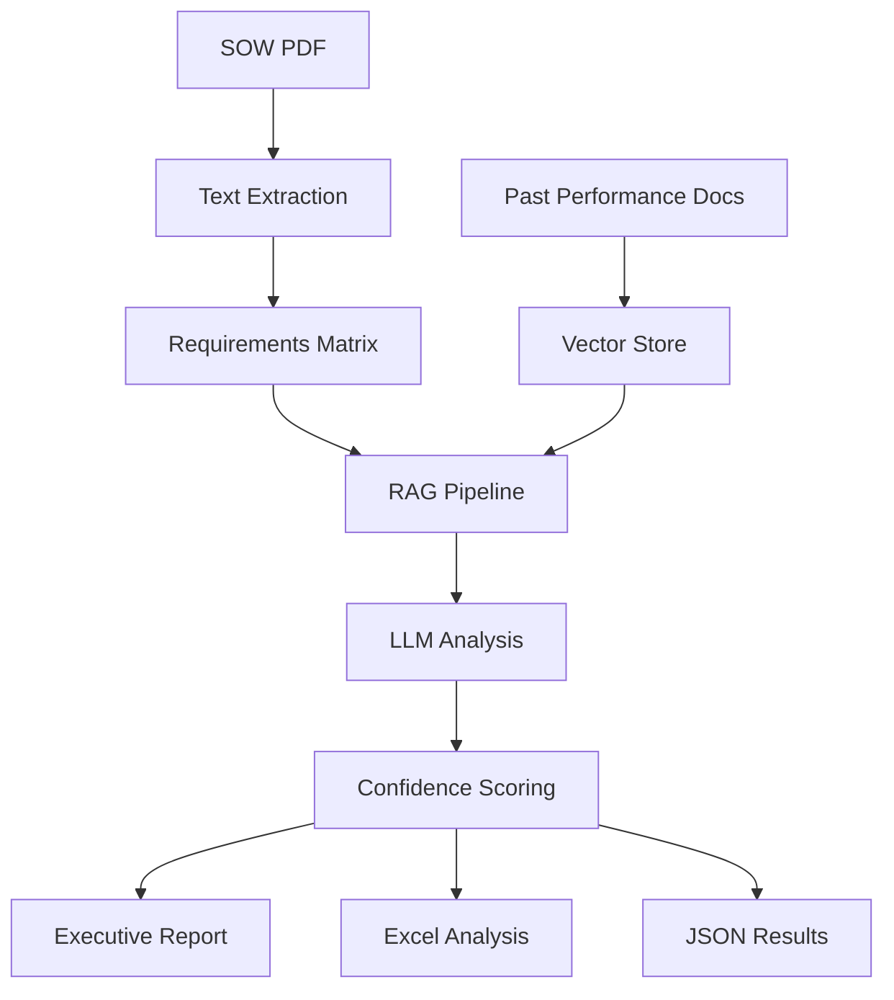

# RAG NewCap Matrix Pipeline 🚀

[](https://www.python.org/downloads/)
[](https://openai.com/)
[](https://opensource.org/licenses/MIT)

An advanced **Retrieval-Augmented Generation (RAG)** pipeline for automated capability analysis of Statement of Work (SOW) requirements against past performance documents.

## 🎯 **Overview**

This pipeline processes SOW requirements and matches them against a comprehensive database of past performance documents to generate detailed capability assessments, confidence scores, and executive reports.

### **Key Features**

- 🔍 **Intelligent PDF Processing**: Advanced text extraction from complex SOW documents
- 🤖 **RAG-Powered Analysis**: Uses OpenAI GPT-3.5-turbo with vector similarity search
- 📊 **Comprehensive Reports**: Executive summaries with specific contract matches
- 🏗️ **Scalable Architecture**: Modular design supporting multiple SOW types
- 🔒 **Production Ready**: Environment-based configuration with security best practices

## 📁 **Project Structure**

```
RAG_NewCapMatrixScript-main/
├── src/                          # Core application code
│   ├── core/                     # Core processing modules
│   │   ├── extract_sow_text_improved.py    # Enhanced PDF text extraction
│   │   ├── rag_pipeline.py                 # Main RAG processing pipeline
│   │   └── pdf_converter.py               # PDF to TXT conversion utilities
│   ├── config/                   # Configuration management
│   │   └── settings.py          # Environment and pipeline settings
│   ├── utils/                    # Utility functions and helpers
│   └── run_rag_analysis.py      # Main analysis execution script
├── data/                         # Data directories (excluded from git)
│   ├── outputs/                  # Analysis results (segregated by SOW)
│   ├── raw/                      # Input documents (excluded)
│   └── vector_store/            # Embeddings storage (excluded)
├── templates/                    # Excel templates and examples
├── main.py                      # Main entry point
├── cleanup.py                   # Utility for cleaning outputs
├── run_analysis.sh             # Automation script
└── requirements.txt            # Python dependencies
```

## 🚀 **Quick Start**

### **Prerequisites**

- Python 3.11+
- OpenAI API key
- Virtual environment (recommended)

### **Installation**

1. **Clone the repository:**
   ```bash
   git clone https://github.com/harsh746-exe/RAG-NewCapMatrix-Pipeline.git
   cd RAG-NewCapMatrix-Pipeline
   ```

2. **Set up virtual environment:**
   ```bash
   python -m venv .venv
   source .venv/bin/activate  # On Windows: .venv\Scripts\activate
   ```

3. **Install dependencies:**
   ```bash
   pip install -r requirements.txt
   ```

4. **Configure environment:**
   ```bash
   cp env.example .env
   # Edit .env and add your OpenAI API key
   ```

### **Usage**

#### **Basic Analysis**
```bash
# Extract requirements from SOW PDF
python src/core/extract_sow_text_improved.py "path/to/sow.pdf"

# Run RAG analysis in production mode
python main.py --mode prod
```

#### **Automated Workflow**
```bash
# Clean, extract, and analyze in one command
./run_analysis.sh --sow "path/to/sow.pdf" --mode prod
```

## 📊 **Supported SOW Types**

- **ATSS** (Attachment Testing and Support Services)
- **OTSS** (Operational Testing and Support Services)  
- **CMS** (Centers for Medicare & Medicaid Services)
- **GSA SBA ECS** (Enterprise Cybersecurity Services)

## 🔧 **Configuration**

### **Environment Variables**
```bash
# Required
OPENAI_API_KEY=your_openai_api_key_here

# Optional
MODEL_NAME=gpt-3.5-turbo
TEMPERATURE=0.1
```

### **Pipeline Settings**
- **Chunk Size**: 1000 characters
- **Chunk Overlap**: 200 characters
- **Top-K Retrieval**: 5 most relevant chunks
- **Vector Store**: ChromaDB with OpenAI embeddings

## 📈 **Output Formats**

### **Generated Files**
- **Excel Analysis** (`.xlsx`): Detailed requirement-by-requirement breakdown
- **JSON Data** (`.json`): Structured analysis results for programmatic access
- **Executive Report** (`.txt`): Strategic insights and recommendations
- **Requirements Matrix** (`.xlsx`): Extracted requirements from SOW

### **Report Features**
- ✅ Confidence scores (0.0 - 1.0) for each requirement
- ✅ Specific past performance contract matches
- ✅ Supporting evidence with source attribution  
- ✅ Strengths and areas for attention analysis
- ✅ Top contract recommendations ranked by relevance

## 🏗️ **Architecture**



## 🤝 **Contributing**

1. Fork the repository
2. Create a feature branch (`git checkout -b feature/amazing-feature`)
3. Commit your changes (`git commit -m 'Add amazing feature'`)
4. Push to the branch (`git push origin feature/amazing-feature`)
5. Open a Pull Request

## 📝 **License**

This project is licensed under the MIT License - see the [LICENSE](LICENSE) file for details.

## 👤 **Author**

**Harsh Dwivedi**
- GitHub: [@harsh746-exe](https://github.com/harsh746-exe)
- Email: edwivediharsh@gmail.com
- LinkedIn: [Harsh Dwivedi](https://linkedin.com/in/harsh746-exe)

## 🙏 **Acknowledgments**

- OpenAI for GPT-3.5-turbo API
- ChromaDB for vector storage
- LangChain for RAG framework
- PyMuPDF for PDF processing

---

⭐ **Star this repository if it helped you!**
